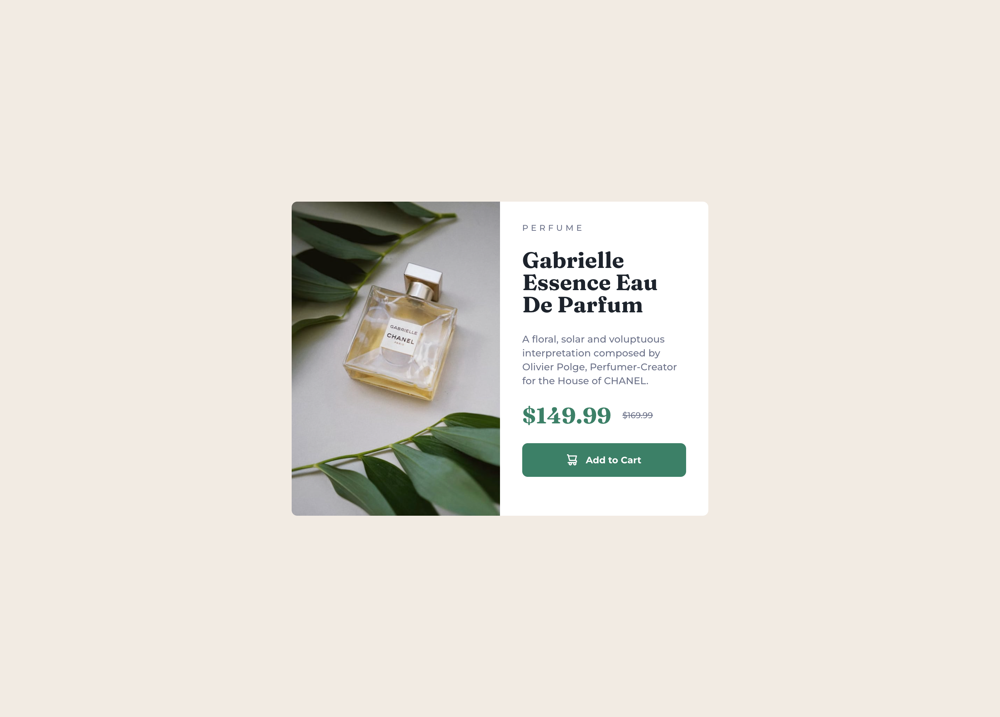

# Frontend Mentor - Product preview card component solution

This is a solution to the [Product preview card component challenge on Frontend Mentor](https://www.frontendmentor.io/challenges/product-preview-card-component-GO7UmttRfa). Frontend Mentor challenges help you improve your coding skills by building realistic projects.

## Table of contents

- [Frontend Mentor - Product preview card component solution](#frontend-mentor---product-preview-card-component-solution)
	- [Table of contents](#table-of-contents)
	- [Overview](#overview)
		- [The challenge](#the-challenge)
		- [Screenshot](#screenshot)
		- [Links](#links)
	- [My process](#my-process)
		- [Built with](#built-with)
		- [What I learned](#what-i-learned)
		- [Continued development](#continued-development)
	- [Author](#author)
	- [Acknowledgments](#acknowledgments)

## Overview

### The challenge

Users should be able to:

-   View the optimal layout depending on their device's screen size
-   See hover and focus states for interactive elements

### Screenshot



### Links

-   Solution URL: [https://github.com/zyalwfie/product-preview-card-component](https://github.com/zyalwfie/product-preview-card-component)
-   Live Site URL: [https://zyalwfie.github.io/product-preview-card-component/](https://zyalwfie.github.io/product-preview-card-component/)

## My process

### Built with

-   Semantic HTML5 Markup
-   SCSS (SASS) for styling
-   SASS Variables and Mixins
-   Custom CSS Reset
-   Flexbox
-   Mobile-first workflow

### What I learned

This project was great practice for reinforcing SASS and HTML5 fundamentals. Here are some key takeaways:

**1. Responsive Images using `srcset`:**
I learned how to implement responsive images using the `srcset` and `sizes` attributes. This allows the browser to load the most appropriate image (mobile or desktop) based on the viewport width, which is crucial for performance.

```html
<picture>
	<source
		media="(min-width: 1440px)"
		srcset="./assets/images/image-product-desktop.jpg"
	/>

	
</picture>
```

**2. SASS Organization with Modules `@use`:**
I practiced the modern way of importing SASS files using @use instead of @import. This helps keep the namespace clean and makes the file structure easier to manage by separating fonts, resets, and mixins into their own files.

**3. SASS Mixins for Media Queries (DRY):**
To keep the CSS code DRY (Don't Repeat Yourself), I created a reusable breakpoint mixin. This makes writing media queries for the mobile-first workflow cleaner and more consistent throughout the app.scss file.

```scss
@use 'sass:map';

$breakpoints: (
	'sm': 375px,
	'xl': 1440px,
);

@mixin breakpoint($size) {
	@if map.has-key($breakpoints, $size) {
		$breakpoint-value: map.get($breakpoints, $size);

		@media (min-width: $breakpoint-value) {
			@content;
		}
	}
	else {
		@warn "Breakpoint '#{$size}' not found on $breakpoints map.";
	}
}
```

### Continued development

For future projects, I want to focus on:

- Implementing CSS Grid for more complex layouts.
- Diving deeper into accessibility (A11y) concepts to ensure all projects are accessible to all users.
- Exploring CSS Custom Properties (CSS Variables) as an alternative or complement to SASS variables, especially for dynamic theming.

## Author

-   Website - [zyalwfie.com](https://www.zyalwfie.com)
-   Frontend Mentor - [@zyalwfie](https://www.frontendmentor.io/profile/zyalwfie)
-   Instagram - [@wwfyy_](https://www.instagram.com/wwfyy_)

## Acknowledgments

- Thanks to Frontend Mentor for providing this challenge.
- Thanks to anyone in the Frontend Mentor community who provided helpful feedback.
